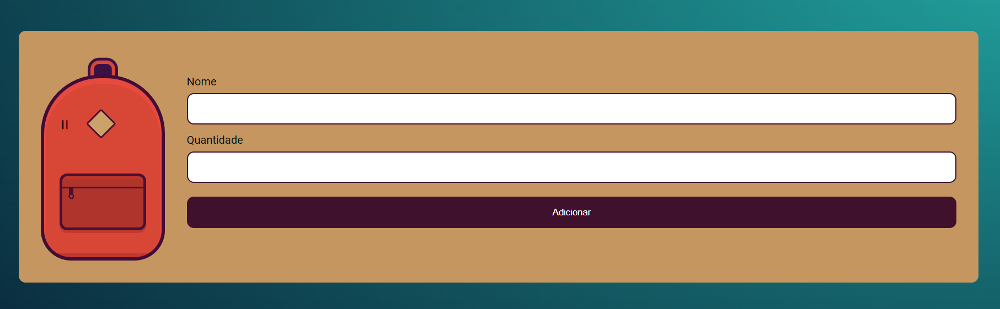
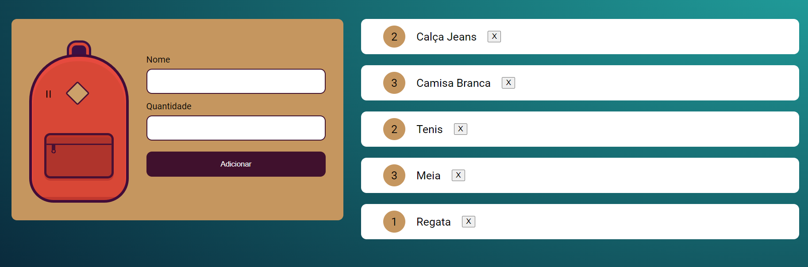

# Mochila de Viagem

Esse é um projeto web que cria uma mochila de viagem interativa. Os itens são adicionados através de um formulário com campos para nome e quantidade.

## Logo

  

## Sumário

- [Tecnologias Utilizadas](#tecnologias-utilizadas)
- [Status](#status)
- [Descrição](#descrição)
- [Funcionalidades](#funcionalidades)
- [Como Usar](#como-usar)
- [Estrutura do Projeto](#estrutura-do-projeto)
- [Autor](#autor)

## Tecnologias Utilizadas

  

    
  

  

    
  

  

    
  

## Status

<!--  -->

## Descrição

A "Mochila de Viagem" é uma aplicação simples que permite aos usuários criar uma lista de itens para levar em suas viagens. Com uma interface amigável, os usuários podem adicionar e gerenciar facilmente os itens que desejam incluir em sua mochila.

## Funcionalidades

- Adição de itens: Os usuários podem adicionar novos itens à lista, especificando o nome e a quantidade desejada.
- Atualização de itens: Caso um item já exista na lista, os usuários podem atualizar sua quantidade.
- Remoção de itens: Os usuários podem remover itens da lista com um simples clique.
- Armazenamento local: A aplicação utiliza armazenamento local para manter a lista mesmo ao recarregar a página.

### Após a adição de itens

  

## Como Utilizar

1. Abra o arquivo `index.html` em seu navegador.
2. Preencha o formulário com o nome e a quantidade do item que deseja adicionar.
3. Clique em "Adicionar" para incluir o item na lista.
4. Para atualizar a quantidade de um item, basta inserir os novos valores e clicar em "Adicionar" novamente.
5. Para remover um item, clique no botão "X" ao lado do item na lista.

## Estrutura do Projeto

- `index.html`: Define a estrutura básica da página, incluindo o formulário e a lista de itens.
- `style.css`: Folha de estilos para garantir uma apresentação agradável.
- `main.js`: Script principal que gerencia a interação do usuário e o armazenamento local.

## Autor

Desenvolvido por Diego Franco.
